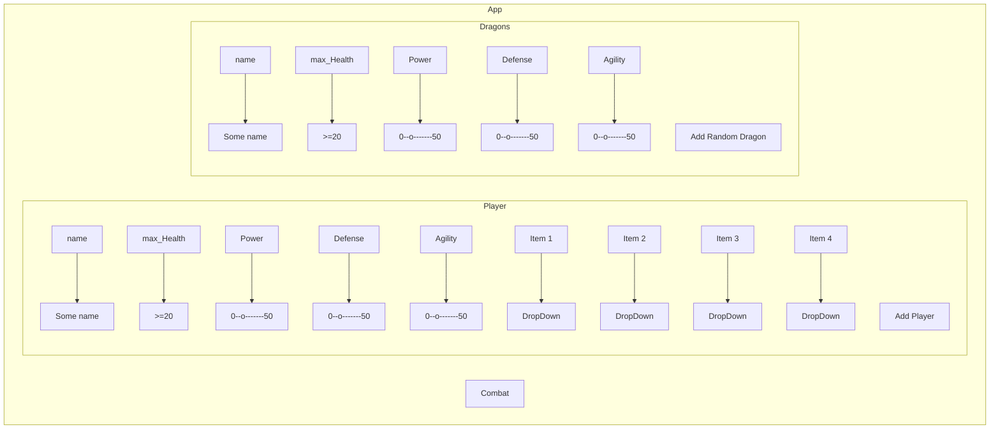
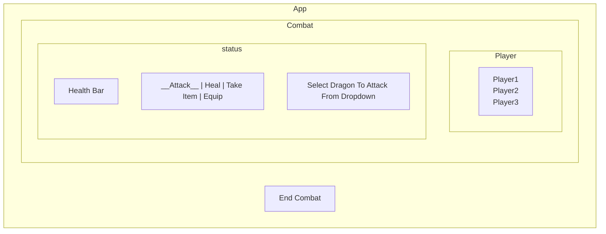
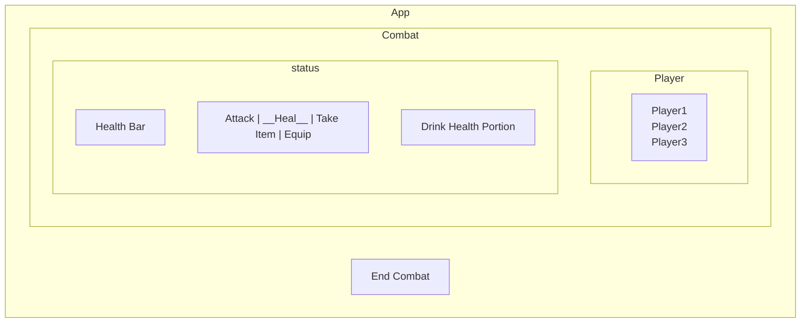
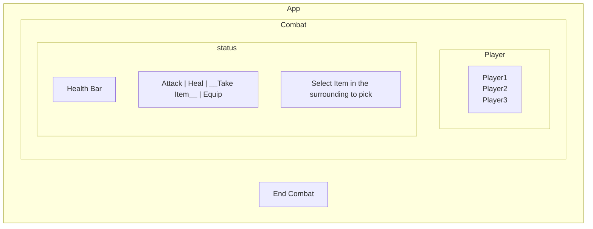
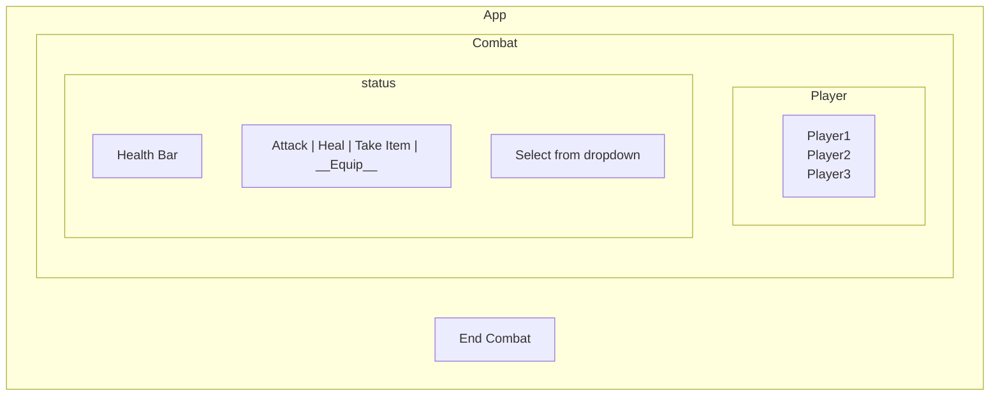

# Summary GamePlay
## Dragon Quest
Use of java swing

### List of status
Each player and dragon should have these status:
```
1) Health
    a) Zero health means the character dies
    b) Gain health through consuming health potions
    c) Lose it through combat. 
    d) All characters start with 20 health. 
    e) A character’s maximum health is randomized at the start of the game and does not change throughout the game.

2) Power

    a) Power ranges from 0-50

3) Defense

    a) Defence ranges from 0-50.
    b) Any personal attributes that reduce the amount of damage incurred during combat should be considered when determining the defence score.

4) Agility 

    a) Agility ranges from 0-50.
    b) A more agile character is more likely to have their attacks hit their target, and to dodge incoming attacks.

```

### Minimum actions available
Only one action can occur per turn.

Player     | Dragon
-----------|-------
Attack     |  Claw
Heal       |  Burn
Take item  | Strike
Equip      | 


### Requirements
There are three distinct modes to the software: 
1) Game Initialisation – Player characters are assigned a name and statistics for health, power, defence and agility. Dragon characters (at least 5) are also initialized, with unique names and statistics according to the game characteristics specified above. Any items / artefacts / consumables / information or other objects to be used within the game are also created. 

2) Combat Initialisation  – Dragons and Players to be involved in the combat are selected from a list, with their pre-configured attributes. Any number of available dragons and players may be included in combat. 

3) Combat – dragons and players fight each other based on the rules described above. After combat is complete, the software should return to combat initialisation mode.

### Additional requirements 
Your software must be developed with comprehensive Unit Testing using JUnit (4 or 5); the best way to 
achieve this reliably is to use Test-Driven Development.

### Submission requirements
Along with the well-written code and comprehensive unit tests covering all functionalities of the game, you are expected to prepare a report which includes the following: 

1) The **design patterns** applied in the software, clearly identifying the functionality where design patterns have had an impact and how this has occurred; 
2) A **personal reflection** on your approach to software development in developing the game. Indicate any difficulties you encountered, and how you went about solving them (approx. 400 words); 
3) A **class diagram** of the game showing all classes (concrete and abstract) and interfaces (fields and methods are optional); 
4) A s**tatement of completion** indicating what you have achieved in your implementation, and any major omissions; and 
5) A **statement of assistance** showing what help you may have found, clearly indicating which components (if any) are work adapted from elsewhere*.









