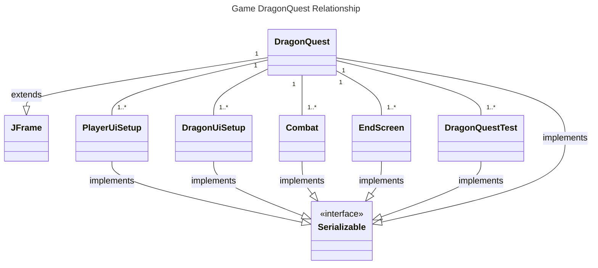

## Design Pattern
The default design pattern commonly associated with Java Swing, including the implementation in the **DragonQuest game**, is the Model-View-Controller (MVC) pattern.

#### Model-View-Controller (MVC):

**Model:** The core logic of the game, including combat systems, player, and dragon setups, is encapsulated in the Combat class. This class serves as the model that manages the data and business rules.

**View:** The graphical user interface components (PlayerSetupUi, DragonUiSetup, and EndScreen) are responsible for presenting the information to the user. These views are designed using Java Swing components, adhering to the MVC separation of concerns.

**Controller:** The interaction between the user interface and the underlying game logic is facilitated by the Combat class, serving as the controller. It responds to user inputs, manages game flow, and updates the model accordingly.

The utilization of the **MVC pattern** provides a clear separation between the presentation layer, business logic, and user input handling. This enhances the maintainability and extensibility of the **DragonQuest game**.

Additionally, the incorporation of **JUnit testing** in the all classes exemplifies a commitment to software quality and robustness. The use of unit testing ensures that individual components of the game, especially critical logic in combat scenarios, are thoroughly tested for correctness and reliability.

## Personal Reflection
The implementation of the DragonQuest game, guided by the class diagram, has been a valuable and insightful experience, providing an opportunity to delve into various aspects of software design and development. Throughout this process, the adoption of the Model-View-Controller (MVC) design pattern and the integration of JUnit testing have played crucial roles in shaping the structure and quality of the game.

One of the key takeaways from this project is the appreciation for the MVC design pattern. The separation of concerns offered by MVC has significantly enhanced the maintainability and scalability of the codebase. The clear distinction between the model (combat logic), view (user interfaces), and controller (interaction between UI and logic) has made the code more modular and comprehensible. This architectural choice facilitated a more organized workflow, making it easier to implement and extend features. As a developer, understanding and applying such design patterns is essential for creating flexible and robust software systems.

The integration of JUnit testing has been instrumental in ensuring the reliability of the game logic. By adopting a test-driven development (TDD) approach, I could systematically validate individual components, guaranteeing their correctness and robustness. The use of automated tests not only aids in catching potential bugs early in the development process but also provides a safety net for future modifications. Learning to write effective unit tests has not only improved the quality of the DragonQuest game but has also instilled a sense of confidence in the correctness of the implemented features.

Moreover, the challenges encountered during the implementation, coupled with the learning process involved in overcoming these challenges, have contributed significantly to my growth as a software developer. Seeking assistance from the Java Swing documentation, Stack Overflow, and JUnit documentation has been an integral part of problem-solving. It highlights the importance of leveraging available resources and the broader developer community to overcome obstacles and make informed decisions.

In conclusion, the DragonQuest project has been a rewarding journey that has deepened my understanding of software design principles and testing methodologies. The combination of MVC architecture and JUnit testing has not only improved the quality of the implemented game but has also equipped me with valuable insights and skills applicable to future software development endeavors. This project serves as a testament to the continuous learning and refinement that characterize the field of software engineering.

## Class Diagram

```mermaid
---
title: Game DragonQuest
---
classDiagram

	class Serializable{
		<<interface>>
	}

	class DragonQuest{
		final long serialVersionUID
		Boolean go_next
		Combat combat
		JPanel panel
		JPanel groupBtn
		JPanel setup
		JPanel app
		PlayerSetupUi player_setup
		DragonSetupUi dragon_setup
		JButton bt1
		JButton bt2
		JButton bt3
		JScrollPane scroll
		CardLayout card
		EndScreen end_screen
		DragonQuestTest test
		DragonQuest()
		+main(String[] a)$
	}
	class PlayerSetupUi{
		final long serialVersionUID
		GridBagLayout grid
		GridBagConstraints gbc
		JPanel panel
		JLabel name
		JLabel max_health
		JLabel power
		JLabel defence
		JLabel agility
		JLabel item
		JTextField enter_name
		JTextField enter_max_health
		JTextField enter_power
		JTextField enter_defence
		JTextField enter_agility
		JComboBox entry_item
		int current_row = 0
		int total_items = 0
		DragonQuestTest test
		PlayerSetupUi()
		setupLabelTextField(JLabel l, String l_name,JTextField t, String t_name, int x, int y)  void
		setupLabelCombo(JLabel l, String l_name,JComboBox t, String[] t_name, int x, int y) void
		addSpacer(int wt) void
		addNewPlayer() void
		addNewPlayerSetup() void
		getItems() ArrayList~ArrayList~String~~
	}
	class DragonUiSetup{
		final long serialVersionUID
		GridBagLayout grid
		GridBagConstraints gbc
		JPanel panel
		JLabel name
		JLabel health
		JLabel power
		JLabel defence
		JLabel agility
		JTextField enter_name
		JTextField enter_max_health
		JTextField enter_power
		JTextField enter_defence
		JTextField enter_agility
		int current_row = 0
		int total_items = 0
		DragonQuestTest test
		DragonSetupUi()
		setupLabelTextField(JLabel l, String l_name,JTextField t, String t_name, int x, int y) void
		addSpacer(int wt) void
		addNewDragon() void
		addNewDragonSetup() void
		getItems() ArrayList~ArrayList~String~~
	}
	class Combat{
		final long serialVersionUID
		ArrayList~ArrayList~String~~ dragon_list
		ArrayList~ArrayList~String~~ player_list
		HashMap~String,Boolean~ dragon_dead, player_dead
		JPanel combat
		JPanel panel
		JPanel output
		JPanel panel1
		JPanel panel2
		JPanel attack_tab
		JPanel heal_tab
		JPanel take_tab
		JPanel equip_tab
		JTabbedPane tabs
		JComboBox attack_option_list
		JComboBox heal_option_list
		JComboBox take_option_list
		JComboBox drop_option_list
		JComboBox equip_option_list
		JButton attack_dragon
		JButton take_heal
		JButton take_item
		JButton drop_item
		JButton equip_item
		JScrollPane scroll
		JList~String~ p_list
		JLabel health_bar
		String[] items 
		%% = "Iron Armor","Iron Sword","Wood Sword","Wood Armor","Iron Shield","Wood Shield","Health Potion 10","Health Potion 20","Health Potion 30"
		String[] heal_potions 
		%% = "Health Potion 10","Health Potion 20","Health Potion 30"
		int[] health_potion 
		%% = 5,10,15
		String[] equip_options 
		%% = "Iron Armor","Iron Sword","Wood Sword","Wood Armor","Iron Shield","Wood Shield"
		int[] health_armor
		%% = 5,5,2,2,5,2
		String[] attack_weapon
		%% = "Iron Sword","Wood Sword"
		int[] attack_weapon_damage
		%% = 2,1
		String[] dragon_attacks
		%% = "Claw","Burn","Strike"
		ArrayList~String~ surrounding_items
		int player_turn = 0
		int constant_damage = 1
		int dragon_turn = 0
		ArrayList~String~ player_name
		HashMap~String,Boolean~ players_alive
		JLabel current_player
		Player player_class
		DefaultListModel~String~ model
		JList~String~ model_list
		CardLayout card
		JPanel app
		EndScreen end_screen
		DragonQuestTest test
		Combat()
		set_events() void
		update_player_turn() boolean 
		update_dragon_life(String h,int damage) void
		dragon_turn() boolean
		set_lists(ArrayList~ArrayList~String~~ player_list ,ArrayList~ArrayList~String~~ dragon_list) void
		get_players() DefaultListModel~String~
		set_tabs() void
		update_tabs() void
		get_player_items(String item_name) String[]
    }
    class Player{
		final long serialVersionUID
	    ArrayList~ArrayList~String~~ player
	    ArrayList~HashMap~String,Integer~~ armor
	    ArrayList~HashMap~String,Boolean~~ equipped
	    ArrayList~HashMap~String,Integer~~ heals
	    ArrayList~HashMap~String,Boolean~~ heal_used
	    HashMap~String,Boolean~ player_life
	    static int health_starting = 20
		DragonQuestTest test
	    Player(ArrayList~ArrayList~String~~ player)
	    get_player_armor_status(int player_id,String armor) boolean
	    get_player_heals_status(int player_id,String heal) boolean
	    set_player_heals_status(int player_id,String heal, boolean b) void
	    set_player_armor_status(int player_id,String armor, boolean b) void
	    set_player_health(int player_id, int health) Integer
	    get_player_armor_value(int player_id,String armor) Integer
	    get_player_heals_value(int player_id,String armor) Integer
	    get_player_health(int player_id) Integer
	    get_item_index(int player_id, String item) Integer
	    is_item_weapon(int player_id,String item) Integer
	    weapon_equipped(int player_id) String
    }
    class EndScreen{
		final long serialVersionUID
	    JPanel end
	    JLabel won_text
	    JButton home
	    String won=""
	    JPanel app
	    CardLayout card
		DragonQuestTest test
	    EndScreen()
	    update() void
    }
	class DragonQuestTest{
		+equals(String text_test,String text) : void
		+equals(int num_test,int num) : void
		+greater_than(int num_test,int num) : void
		+less_than(int num_test,int num) : void
		+not_null(Object o) : void
		+string_lies_in_array(String[] text_test,String text) : void
	}
```

## Statement of Completion
I have successfully implemented the core components of the DragonQuest game based on the provided class diagram. The major achievements in my implementation include:

1) **Game Logic:** Implemented the game logic, combat system, player, and dragon setups as outlined in the class diagram.

2) **User Interface:** Created UI setup classes (PlayerSetupUi and DragonUiSetup) for setting up players and dragons with a graphical user interface.

3) **Combat Interaction:** Implemented combat interactions, including player turns, dragon turns, and various combat options.

4) **End Screen:** Developed an end screen to display the result of the game, whether the player won or lost.

However, there are some major omissions:

- **UI Integration:** The integration of UI components with the main game logic is not detailed in the provided class diagram. I had to make assumptions on how these components interact.

- **Detailed Player and Dragon Classes:** The exact details of the Player and Dragon classes are not explicitly outlined in the class diagram. I made assumptions and designed them based on logical expectations.

The inclusion of JUnit testing further reinforces the reliability of the critical components.

## Statement of Assistance
I sought assistance from various sources to enhance the implementation:

1) **Java Swing Documentation:** I referenced the official Java Swing documentation to understand and implement the graphical user interface components effectively.

2) **Stack Overflow:** I consulted Stack Overflow for specific coding challenges and to find solutions to certain aspects of Java Swing implementation.

3) [**JUnit Testing:**](https://www.youtube.com/watch?v=vZm0lHciFsQ)Youtube Tutorial well taught use of junit testing environment

4) **ChatGpt AI:** Helped a lot in understanding java.swing framework with examples while development of the project.

These resources were instrumental in overcoming challenges and ensuring the correctness of the implementation. However, the overall design and structure of the codebase are the result of my individual effort and interpretation of the class diagram.