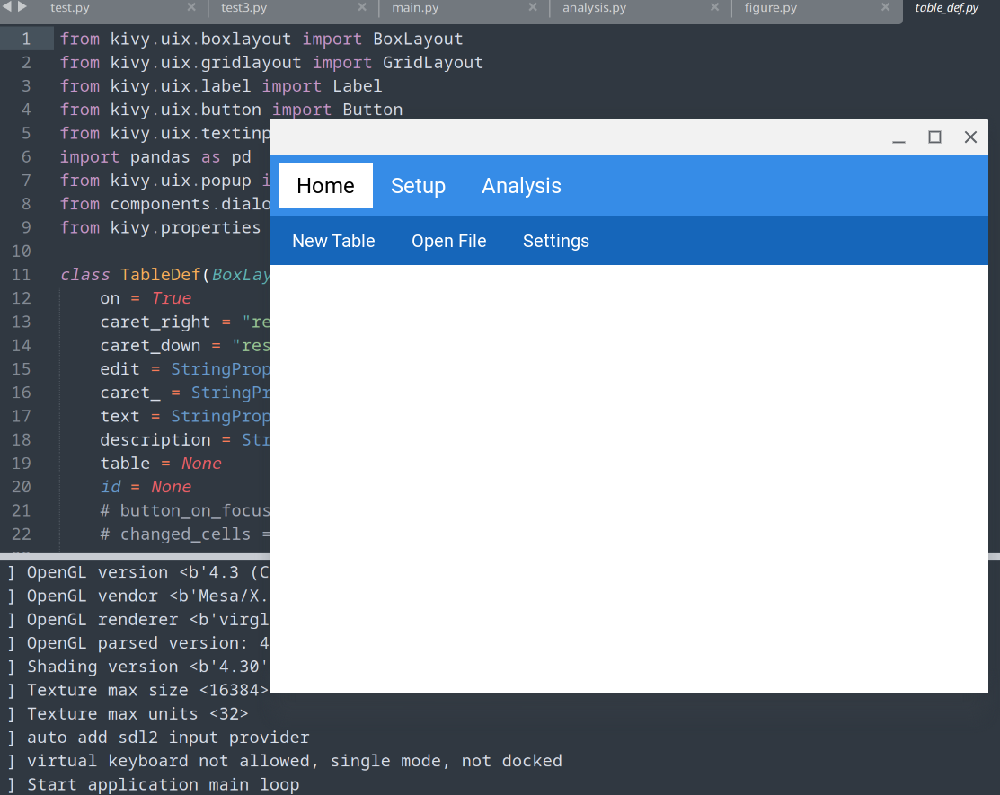
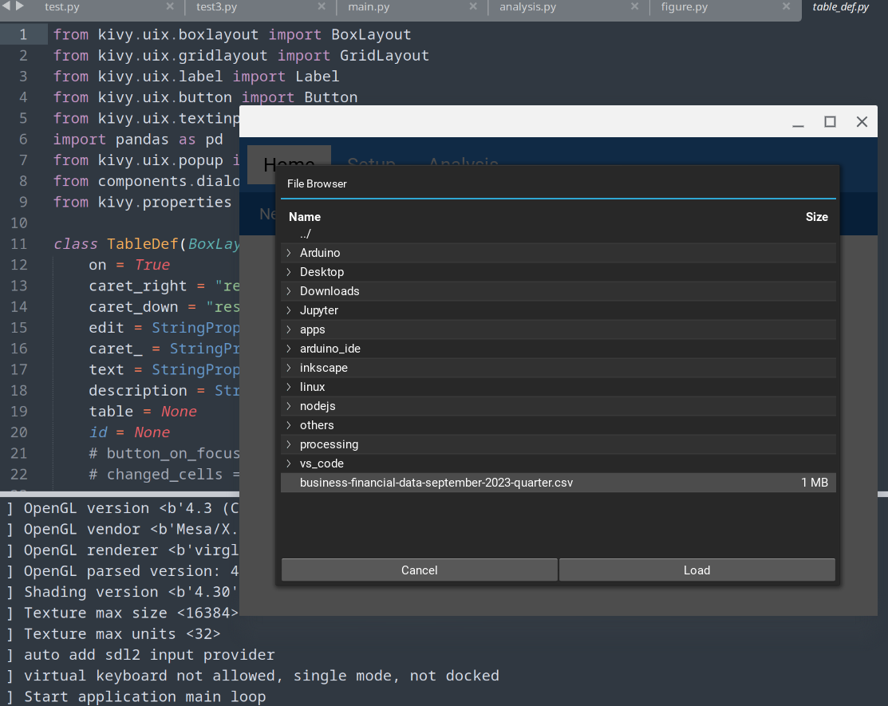
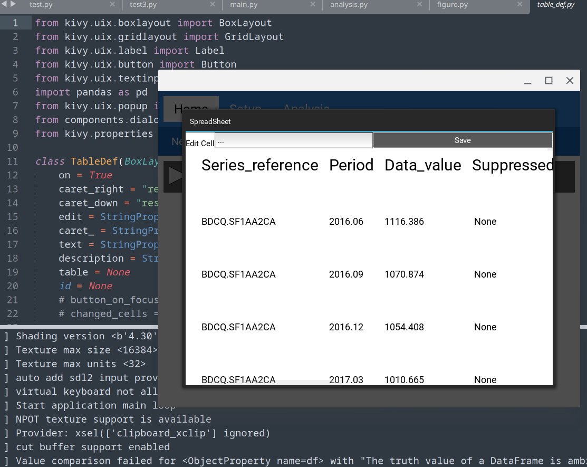
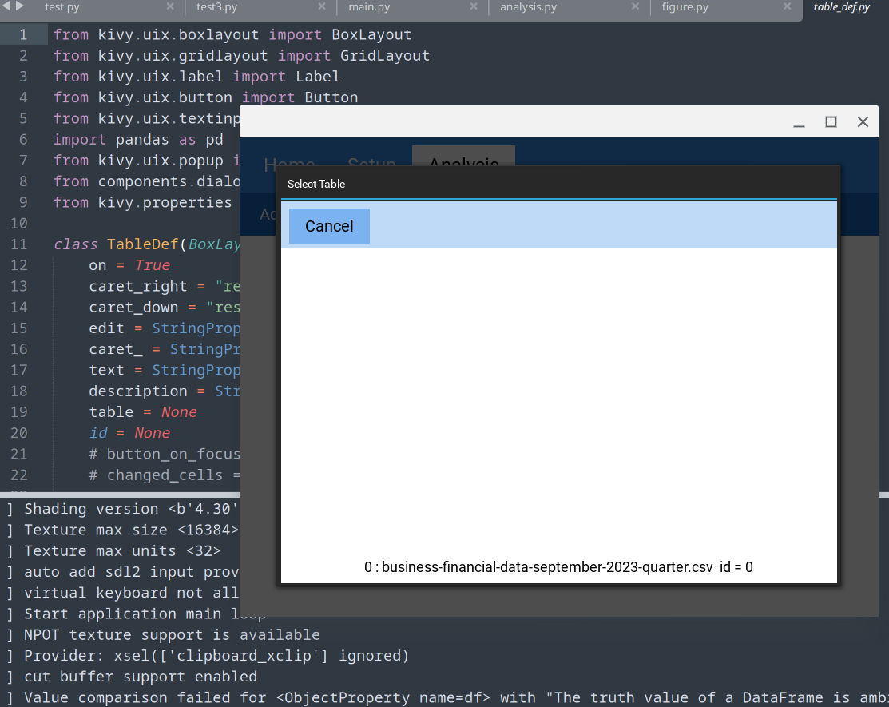
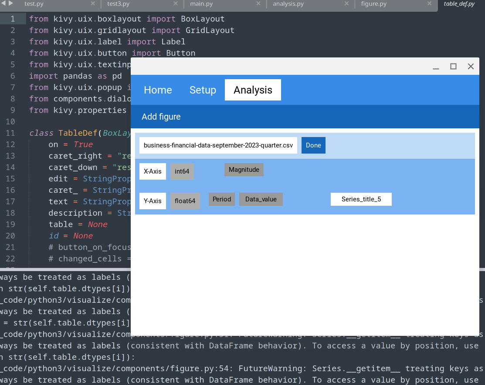

## This project utilizes the power of kivy application development and python powerful data science libraries like pandas, numpy, matplotlib,.. to make an app capable of analysing , manupulating, and visualizing data.

