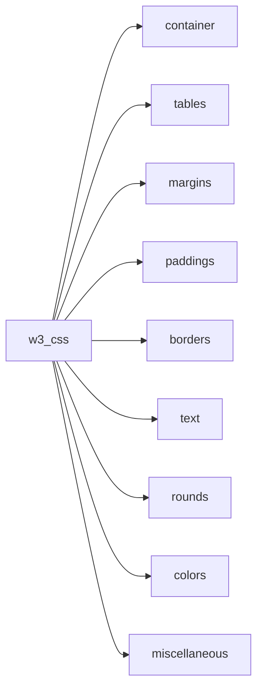
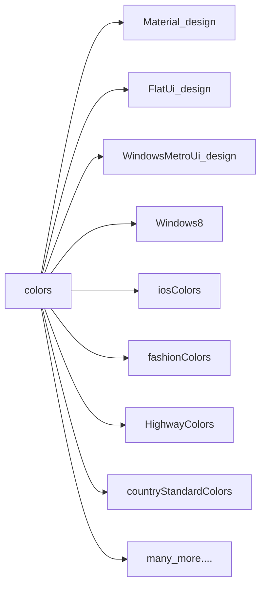
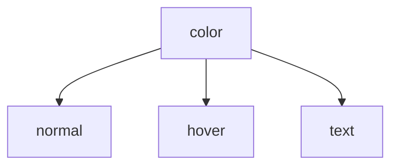

# Tutorial 1
The following is to teach you about basics of w3-css.

## Contents Diagram


## Intro
- Note that every class name starts with w3-, eg w3-teal.


## Texts

### defaults
```css
h1  {font-size:64px;}
h2  {font-size:48px;}
h3  {font-size:36px;}
h4  {font-size:24px;}
h5  {font-size:20px;}
h6  {font-size:18px;}

and for any text lower classes works the best
w3-tiny -> 10px
w3-small -> 12px
w3-medium (Default) -> 15px
w3-large -> 18px
w3-xlarge -> 24px
w3-xxlarge -> 36px
w3-xxxlarge -> 48px
w3-jumbo -> 64px
```

### fonts you can use
```css
w3-serif
w3-sans-serif
w3-monospace
w3-cursive
```
In case you want to use other fonts [click the link](https://www.w3schools.com/w3css/w3css_fonts.asp) and [this google font api](https://www.w3schools.com/w3css/w3css_fonts_google.asp)

## Colors

There are even **color themes**.
You can even use color generator and use it as your own theme.

### The major colors we are going to learn are:
```
amber
aqua
blue
light-blue,
brown
cyan
blue-grey
green
light-green
indigo
khaki
lime
orange
deep-orange
pink
purple
deep-purple
red
sand
teal
yellow
white
black
grey
light-grey
dark-grey
pale-red
pale-green
pale-yellow
pale-blue
```



### You can use 
- w3-color         --> background
- w3-text-color    --> text color
- w3-border-color  ---> border
- w3-hover-color  
- w3-hover-text-color
- w3-hover-border-color

## Container
w3-container has 16px left and right padding.

## tables
| tables      |    description |
--------------|----------------
|w3-table	| Container for an HTML table|
|w3-striped	| Striped table|
|w3-border	| Bordered table|
|w3-bordered  |	Bordered lines|
|w3-centered  |	Centered table content|
|w3-hoverable  |	Hoverable table|
|w3-table-all  |	All properties set|
| w3-ul   | used for lists |

## margin
|margins          | Pixels occupied    |
|-----------------|---------------------
| w3-margin       | 16px on all sides  |
| w3-margin-top   | 16px on top side   |
| w3-margin-bottom| 16px on bottom side|
| w3-margin-left  | 16px on left side  |
| w3-margin-right | 16px on right side |
| w3-section      | 16px on top and bottom|

## padding

| paddings    | Pixels occupied |
--------------|-----------------
| w3-padding   | 8px top and bottom, 16px left and right|
| w3-padding-small | 4px top and bottom, 8px left and right|
| w3-padding-large |12px top and bottom, 24px left and right|
| w3-padding-16 | 16px top and bottom |
| w3-padding-24 | 24px top and bottom |
| w3-padding-32 | 32px top and bottom |
| w3-padding-48 | 48px top and bottom |
| w3-padding-64 | 64px top and bottom |

## borders
| borders     | defines   |
--------------|---------------|
| w3-border   | top, right, bottom, left |
| w3-border-top | top |
| w3-border-bottom | bottom |
| w3-border-left | left |
| w3-border-right | right |
| w3-border-0 | removes all borders |
| w3-border-color | uses any color |
| w3-hover-border-color | use any color |
| w3-bottombar | 6px bottom border |
| w3-topbar | 6px top border |
| w3-leftbar | 6px left border |
| w3-rightbar | 6px right border |

### note you can use style="border-style: solid;border-width:30px 15px 10px 5px;" for 25px top, 10px right, 4px bottom and 35px left, to change border size and don't use w3-border in that case
```css
e.g.
 <p class="w3-border-red" style="border-style: solid;border-width:30px 15px 10px 5px;">Text</p>
```

## rounds
### These can be used with either divs or images
| class   | border pixel size |
----------|---------------
| w3-round | 4px  |
| w3-round-small | 2px  |
| w3-round-medium | 4px  |
| w3-round-large | 8px  |
| w3-round-xlarge | 16px  |
| w3-round-xxlarge | 32px  |
| w3-circle | 100% round |

## miscellaneous
| class      | define    |
--------------|------------
| w3-panel    | 16px top and bottom margin and a 16px left and right padding to any html element |
| w3-card and w3-card-2 | 2px bordered shadow div |
| w3-card-4  | 4px bordered shadow div |
| w3-left-align | for left text align |
| w3-right-align | for right text align |
| w3-center | for center text align |
| w3-wide | spacing between letters increases |
| w3-show-inline-block | for making an inline block |
| w3-bar and w3-bar-item | to arrange in horizontal blocks |
| w3-bar-block and w3-bar-item | for vertical bar |
| w3-block | width:100% |
| w3-clear |  to clear float left or right |
| w3-left and w3-right | for left and right floating element |
| w3-content | centers whole page and width of 986px |
| w3-auto | centers whole page and width of 1140px |

### and normally use
```html
<i> for italic </i>
<b> for bold </b>
<h1 style="text-shadow:1px 1px 0 #444"> for text shadow </h1>
```