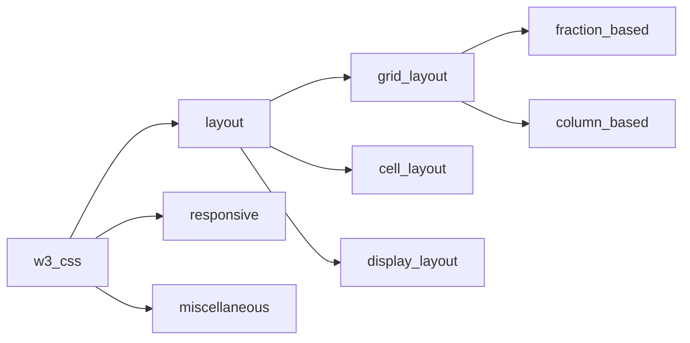

# Tutorial 2

## Contents

## Grid Layout
Every grid layout parent class should start with either
| class           | description |
------------------|--------------------
| w3-row	    | Container for responsive classes, with no padding|
|w3-row-padding	| Container for responsive classes, with 8px left and right padding|

### fraction Based

|Class	         | Description |
-----------------|------------------
|w3-half	     | Occupies 1/2 of the window (on medium and large screens)|
|w3-third	     | Occupies 1/3 of the window (on medium and large screens)|
|w3-twothird	 | Occupies 2/3 of the window (on medium and large screens)|
|w3-quarter	     | Occupies 1/4 of the window (on medium and large screens)|
|w3-threequarter | Occupies 3/4 of the window (on medium and large screens)|
|w3-rest	     | Occupies the rest of the column width|
|w3-col	         | Defines one column in a 12-column responsive grid|
|w3-mobile	     | Adds mobile-first responsiveness to a cell (column).Displays elements as block elements on mobile devices.|

### Column Based

|Class	         | Description |
-----------------|------------------
| l1 - l12	| Responsive sizes for large screens  |
| m1 - m12	| Responsive sizes for medium screens |
| s1 - s12	| Responsive sizes for small screens |

## Responsive

|Class	         | Description |
-----------------|------------------
| w3-hide-small	 | Hides content on small screens (less than 601px) |
| w3-hide-medium | 	Hides content on medium screens |
| w3-hide-large	 | Hides content on large screens (larger than 992px) |

## Cell Layout

|Class	         | Description |
-----------------|------------------
| w3-cell-row |	Container for cells (columns). |
| w3-cell	| Layout cell (column). |
| w3-cell-top	| Aligns content at the top of a cell (column). |
| w3-cell-middle	| Aligns content at the vertical middle of a cell (column). |
| w3-cell-bottom	|Aligns content at the bottom of a cell (column).|

## Display Layout

|Class	         | Description |
-----------------|------------------
| w3-display-container	| Container for w3-display-classes
| w3-display-topleft	| Displays content at the top left corner of the w3-display-container
| w3-display-topright	| Displays content at the top right corner of the w3-display-container
| w3-display-bottomleft	| Displays content at the bottom left corner of the w3-display-container
| w3-display-bottomright |	Displays content at the bottom right corner of the w3-display-container
| w3-display-left	| Displays content to the left (middle left) of the w3-display-container
| w3-display-right	| Displays content to the right (middle right) of the w3-display-container
| w3-display-middle	| Displays content in the middle (center) of the w3-display-container
| w3-display-topmiddle	| Displays content at the top middle of the w3-display-container
| w3-display-bottommiddle	| Displays content at the bottom middle of the w3-display-container
| w3-display-position	| Displays content at a specified position in the w3-display-container
| w3-display-hover	| Displays content on hover inside the w3-display-container

## Miscellaneous

Class	         | Description 
-----------------|------------------
w3-show	| Shows an element (display: block)
w3-hide	| Hides an element (display: none)
w3-hover-opacity | makes less opaque when hovered
w3-hover-opacity-off | cancels off w3-opaque when hovered
w3-btn	| A rectangular button with a shadow hover effect. Default color is black.
w3-button	| A rectangular button with a gray hover effect.
w3-ul | for lists
w3-opacity-min | 25% transparant
w3-opacity | 50% transparant
w3-opacity- max | 75% transparant
w3-opacity-off | 0% transparent
