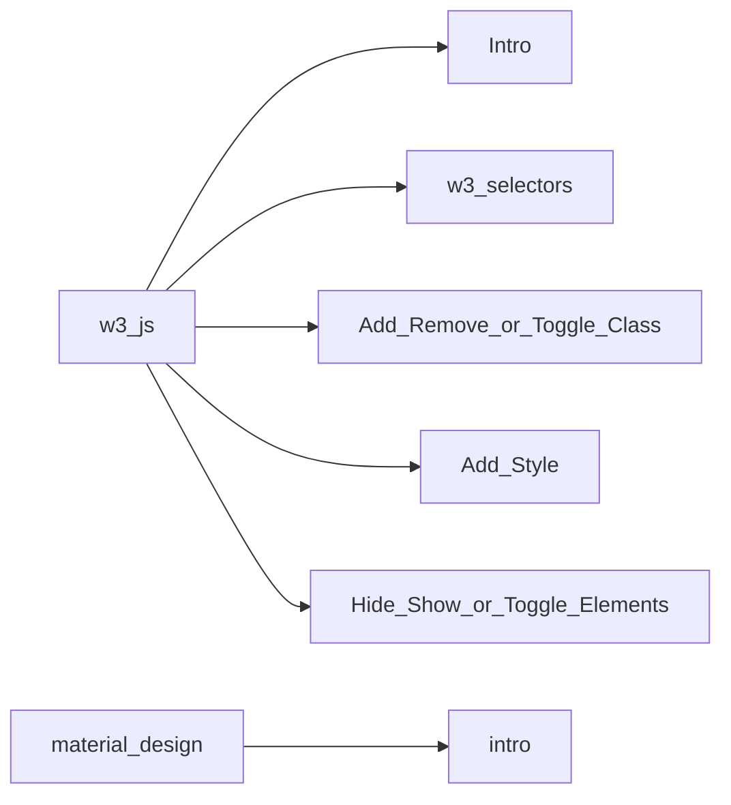

# Tutorial 3

## Contents

## w3 selectors

structure   | Definition
------------------|--------------
w3.action(selector) | perform actions on the selected element

There are 3 types of selectors most commonly used that are:

1) class selector (e.g.,  .parent_class)
2) id selector (e.g.,  #parent_id)
3) element tag selector (e.g. , h2)

and some common selectors
Selector |	Description	Example
----------|-------------------
("*")	| Selects all elements in the document	
(this)	| Selects the current HTML element	
("p.intro")	| Selects all 
 elements with class="intro"	
("div p")	| Selects all 
 element inside all 
 elements	
("div p:first-child")	| Selects the first 
 element inside all 
 elements	
("[href]")	| Selects all elements with an href attribute	
("a[target=_blank]")	| Selects all \<a> elements with a target attribute value equal to "_blank"	
("p:nth-child(even)")	| Selects all even \
 elements

for more description, [css selector reference](https://www.w3schools.com/cssref/css_selectors.asp).

## Hide, Show or toggle_hide_show elements

function | description 
--------|--------------
w3.hide(selector) | To hide selected element 
w3.show(selector) | To show selected element
w3.toggleShow(selector) | To toggle between hide andshow selected element

## Add style
function | description 
--------|--------------
w3.addStyle(selector,'property','value') | adds a style to selected elements

## Add, Remove or Toggle class
function | description 
--------|--------------
w3.addClass(selector,'class') | adds a class selected element
w3.addClass(selector,'class1 class2 class3...') | adds multiple class selected element 
w3.removeClass(selector,'class') | removes a class selected element
w3.removeClass(selector,'class1 class2 class3...') | removes multiple class selected element 
w3.toggleClass(selector,'class') | toggles adding or removing of a class selected element
w3.toggleClass(selector,'class1 class2 class3...') | toggles adding or removing of multiple class selected element 
