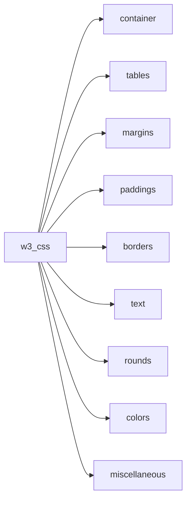
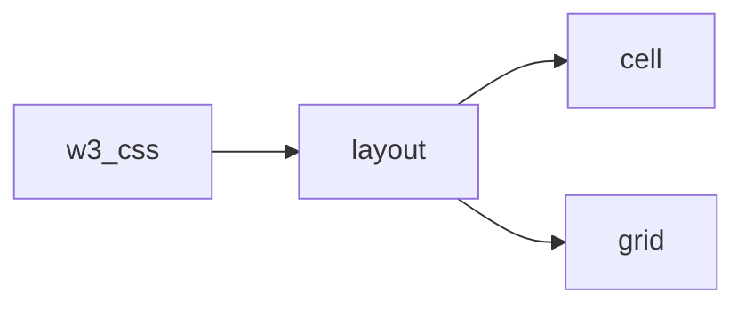

# Tutorial Preview
[w3-schools w3-css click to go to the site](https://www.w3schools.com/w3css/default.asp)

## Day 1

```mermaid
graph LR;
    w3_css-->container;
    w3_css-->tables;
    w3_css-->margins;
    w3_css-->paddings;
    w3_css-->borders;
    w3_css-->text;
    w3_css-->rounds;
    w3_css-->colors;
    w3_css-->miscellaneous;
```

## Day 2

```mermaid
graph LR;
    w3_css-->layout;
    layout-->cell;
    layout-->grid;
```

